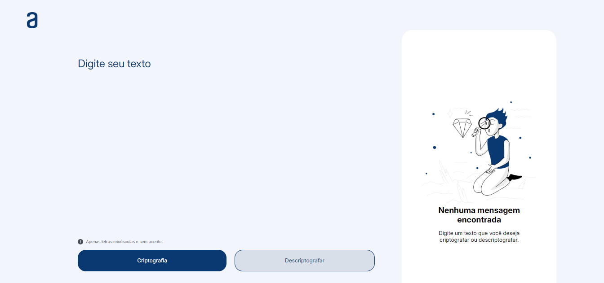
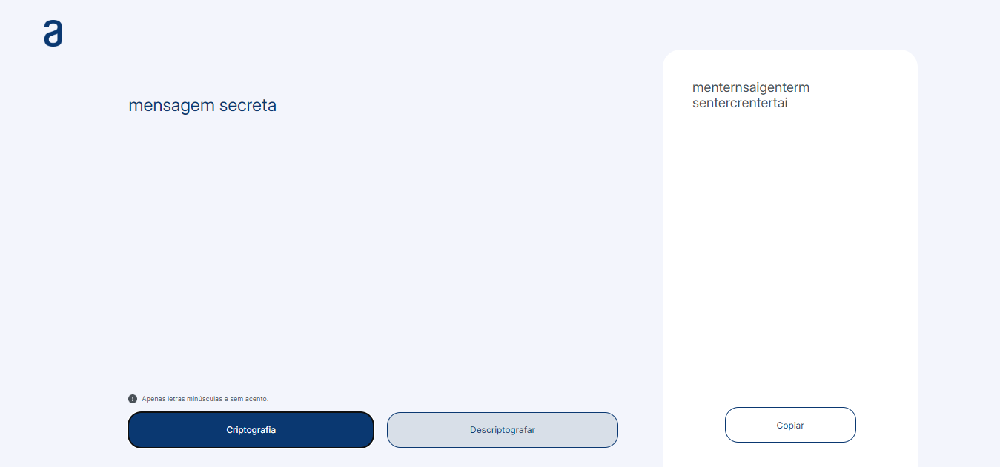

# Decodificador de Texto

Esse foi um desafio proposto pelo Curso One da Alura. A proposta foi a criação de uma aplicação web em que fosse possível criptografar e descriptografar o texto desejado pelo usuário. O site também é responsivo para os dispositivos móveis.

## Screenshots

[🔗 clique aqui para acessar](https://decodificador-de-texto-psi-neon.vercel.app/)

## 💻 Tecnologias
* HTML
* CSS
* JavaScript
* Git
* Github
